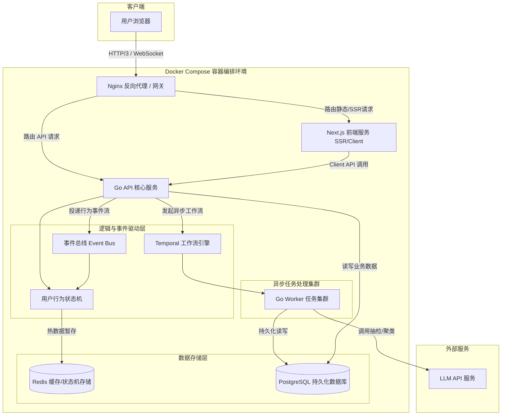
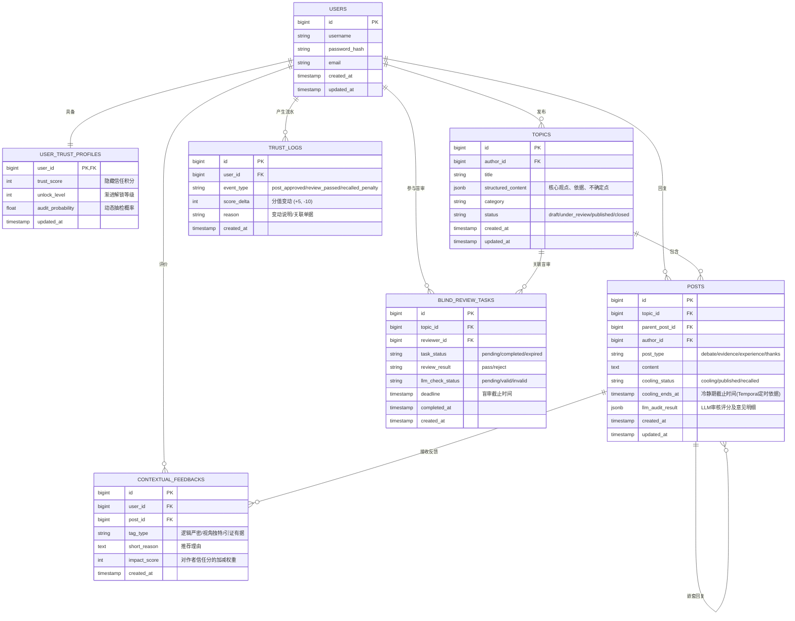

# 问题背景与实际应用意义 
## 问题背景

移动互联网的普及与智能终端的无差别下沉，让网络表达彻底打破了阶层与技术的门槛。然而，这种随时随地表达的极低门槛，也严重破坏了传统 PC 时代论坛所独有的慢节奏与深度讨论氛围。 
当表达成本近乎为0时，发言者对文本的心理评估价值随之贬值，导致网络空间充斥着未经过滤的情绪宣泄、无逻辑对线与营销水军，有效内容的信噪比急剧下降。传统的网络社区在面对大量低意图流量冲刷时，纷纷出现文字劣化、严肃讨论被边缘化以及平台娱乐化的问题。 

## 现有的解决方案的局限与副作用

针对内容信噪比下降的问题，各种BBS平台曾尝试过多种筛选机制（如完全邀请制、付费订阅墙、Web3 链上资产门槛、专业身份认证等）。但这些机制在过滤低质内容的同时，也带来了严重的副作用——媒介本身的特质筛选出了不必要的群体的共性。付费门槛虽然阻断了广告与水军，但也排除了缺乏支付渠道的年轻人、学生以及精打细算但有深度思考能力的群体。进入付费圈子的群体在底色上天然向消费主义、中产阶层温和主义或特定政治倾向靠拢。Web3 / 去中心化方案将社区用户限定在极客、技术精英与加密货币交易者之中，导致话语体系高度趋向技术决定论与特定圈子共识。就算是早期家庭PC时代，物理条件、接入费、普遍社会习惯也隐性筛选出了拥有固定电脑与充裕闲暇时间的文化阶层。 
这种由筛选工具带入的隐形的条件，容易演变为社区部落化与回声室效应的根源。圈内群体极易将结构赋予的狭隘共识误认为是普世真理，进而对外界产生傲慢与防御性的割席心态。导致社区本身环境走向相反另一面，越来越封闭与偏激。 
## 应用意义

本项目的核心意义在于试图构建一套只过滤行为，不过滤身份的低意图摩擦社区机制。 
在认可现在的网络环境、认可社会里多样性的群体都可以低门槛接入平台的前提下，提供零资金、零技术、零身份门槛的准入，对青少年、低收入者及各类社会阶层无差别开放——在此基础上，我们仍然致力于重塑网络讨论习惯——通过引入一些需要微小耗力思考的低摩擦设计，从源头上阻断自动化机器人的批量刷屏，从机制上遏制情绪化的冲动发言，从而让理性思考、有据论证与健康沟通重新成为网络社区讨论的主流习惯。 

---
# 拟解决的主要问题及概要需求分析 

## 拟解决的主要问题

以各种标签切分用户群体，这样的身份筛选会使社区部落化与放大回声室效应。 
参与互动的低门槛会导致情绪化快餐发言与低诚意发言泛滥，许多用户未看先评、纯骂战、无逻辑无根据地反驳。 
点赞、点踩机制导致的低成本表态会抹杀有深度的观点，放大极端情绪。 

## 概要需求分析

为了在不过滤身份标签的前提下提升内容质量，系统需要满足以下需求： 
防止黑灰产批量注册账户恶意刷数据或发放垃圾信息或误导性信息。 
需要有能够让被情绪主导的用户冷静下来思考后有条理发言的静止。 
需要有低意图的仅靠存在就能天生引导用户将感性与客观事实分开看待的机制。 
需要有比传统的赞/踩更理性化的引入更多思考摩擦力的内容评价机制。 
要有能对上述改进后的社区评价机制防滥用的监察机制。 
技术架构需满足峰值1000+QPS压力，具备对用户操作过程而非仅结果的实时监控与异步工作流处理能力和良好的健壮性。

---
# 功能设计 

首先，论坛的基本上的结构依旧延续传统论坛的板块/节点、主题帖与层级回复结构就可以，不需要过激地修改。这种信息组织结构经过数十年互联网实践的检验，已经被事实证明兼具逻辑清晰与高内容承载力。这方面不必赘述，大家都有经验。 
本项目主要需要设计的核心部分，在于基于低摩擦的内容治理机制。这方面的具体需求包含以下几个维度： 

1. 渐进式的权限解锁机制 
全网用户无门槛注册。新注册用户初始仅赋予浏览与收藏权限。系统根据用户的自然阅读时长、合规交互行为累积信任度。随着使用天数的增加，渐进式解锁评论、发帖、发起新话题与参与投票的权限，以时间与耐心代替硬性身份审核，提高自动化黑灰产的养号成本。 

2. 冷静与阅读感知机制 
对于长篇或高争议话题，客户端实时检测视窗滚动行为。用户必须将帖子完整滚动至底部，并在回复框内停留满特定时长后，方可解锁发送按钮，尽量未看先评论的冲动发言。评论与帖子提交后进入固定时长的冷静期。在此期间，内容仅发送者本人可见，并允许无痕撤回与修改，为用户提供自我审查与冷静的机会。同样的，这样的冷静机制也可以用在任何其他有类似需要的场景。 

3. 结构化表达与讨论区分层 
编辑器强制将主楼发帖拆分为结构化模块，引导用户按类似“我的核心观点”、“我支持它的依据”、“我还不确定的地方”进行填写，提升表达逻辑度。（根据不同场景应该有不同模板，这里只是举个例子）讨论区分为各种功能块。用户回复时需选择交互类型（如“质疑与辩论”、“补充论据、论证”、“个人经历、共感”和“单纯感谢”之类的模块）。不同属性的讨论归入各自分支，避免感性抒情与逻辑辩论绞在同一个楼层里。并根据版块划分天生地由结构暗示用户讲客观事实与个人情感分开阐述。  

4. 语境化的反馈系统 
取消一键点赞、点踩，而是附加上具备具体语境的评估标签（比如说“逻辑严密”、“提供了新视角”、“引证真实合理“）。用户进行赞踩时必须勾选具体标签，强制要求打字附带极短的推荐理由。迫使互动者做出最小限度的理性思考，尽量减少只靠直觉的情绪化打分。

5. 随机盲审与动态信任积分 
新用户注册或发布重要长文时，系统随机抽取 3 位不同背景的活跃用户进行匿名盲审。盲审不卡知识水平与观点异同，仅评估“语言是否得体、态度是否真真诚”。 
引入隐藏的信任分体系。参与盲审且判定公正的用户将获得信任分奖励；若存在恶意打压、滥用权力的行为，将扣除高额信任分，并大幅提高其后续自身发言被系统抽检和审核的概率。 
为防止盲审用户滥用权力，引入大语言模型对盲审结果的合理性进行抽样校验。审核积极且公正的用户获得隐藏信任分奖励；若滥用审核权，扣除高额信任分并增加后续自身的被审查频率。 

6. 动态评论区聚类与按权重展示 

当主题帖下的讨论积累到一定数量后，后端调用关键词算法自动将分散的讨论提炼并归类为若干 Tag 版块。和之前的讨论区分层作为两种并行的筛选讨论的方式。结合评论的得分，动态计算并分配不同 Tag 及回复的优先展示权重，优先呈现有据论证的优质内容。 

7. 全流程 LLM 抽检与反作弊 

为防止社区治理机制本身被恶意群体利用或滥用，设置LLM贯穿于社区互动全流程中的抽检包括对随机盲审的结果进行抽样评估，判定评审者的审核是否合理；抽检用户填写的赞踩理由，识别是否存在自动化工具生成的垃圾理由、同质化刷赞或恶意群体刷踩行为。根据 LLM 抽检反馈，系统自动调整相关用户的各种隐藏信任积分。 

---
# 系统架构 

出于训练软件工程能力的初衷，本项目将以上线峰值能抗压1000+QPS的压力为目标设计系统架构。 

系统架构示意图（暂定）：

前端展示层基于 Next.js 框架构建。 

入口与网关层由 Nginx 进行反向代理、静态资源缓存与负载均衡，统一分发流量至 Next.js 服务与 Go API 网关。 

业务服务层基于 Go 语言编写的 API 微服务，配合轻量级用户行为状态机，进行实时合规性校验。 

事件与工作流引擎引入事件总线与 Temporal 持久化工作流引擎，负责处理冷静期等待、盲审状态流转、异步 LLM 抽检等超越 HTTP 请求周期的逻辑。 

任务处理层由 Go Worker 异步消费 Temporal 传递的任务，调用 LLM 进行盲审合理性校验与评论聚类。 

数据存储层用 Redis 来高速缓存与事件状态暂存；PostgreSQL 用于核心业务数据的持久化存储。 

全栈采用 Docker 镜像化打包，并通过 Docker Compose 进行多容器服务编排统一管理 Next.js、Go 服务、Temporal、Redis、Postgres 等镜像环境，实现环境隔离、一键部署。 

---
# 拟采用的数据库设计思路分析

本项目的治理机制的缘故，许多数据的存储模型为了方便处理要重新设计，这里举几个例子： 

传统帖子表一般用 content TEXT，本项目将发帖内容拆分为半结构化数据，用 PostgreSQL 的 JSONB 类型存储，包含观点、论据与疑问点，便于灵活扩展与前端渲染。 

传统的点赞用整数递增计数器实现，本项目要在点赞上额外承载理由等数据，所以应该将互动建模为有向边，存储具体的评估标签类型与短文本推荐理由。 

为支持冷静期、延迟发送与盲审流转等工作流程，必须建立对应的状态表与事件日志表。 

下图仅是一个开题时的概念示意，真实的数据库表可能在初期快速迭代时会有很大变动，要之后再设计

---
# 工作计划安排

## 时间线

第一阶段：细化 API 接口规范与 PostgreSQL 数据库 Schema 设计。搭建基于 Docker Compose 的本地多容器开发环境。 

第二阶段：完成传统论坛基础功能搭建，包括 Next.js 前端主界面与 Go 后端核心 CRUD 接口。贯通用户登录注册、板块浏览、帖子发布、层级评论等基本论坛流程。 

中期检查 

第三阶段：接入 Temporal 工作流引擎，实现发布冷静期与随机同行盲审流转等。在 Next.js 前端实现结构化编辑器与客户端行为感知。对接 LLM 抽检服务与隐藏信任积分更新机制。 

第四阶段：全流程联调，完善 docker compose 一键部署的生产环境配置，进行高并发压力测试，调优 Go 服务与 Redis 缓存层，确保系统在 1000+ QPS 压力下稳定运行。 

软件验收 

## 目标

中期检查完成目标： 
用户能够正常注册/登录，实现板块浏览、主楼发帖、多级回复等传统 BBS 核心功能。 
Next.js 前端与 Go 后端实现 API 通信的接口基本定型；PostgreSQL 数据库建表基本定型；Docker Compose 本地开发环境稳定运行。 
治理模块的数据库表结构定义完毕，后端 API 预留 Mock 接口，为后半程工作流接入做好架构准备。
软件验收最终目标： 
全量实现前面提到的结构化表达、客户端阅读感知、发布冷静期缓冲、随机盲审及隐藏信任积分计算等功能。 
Temporal 引擎稳定驱动异步任务，LLM 成功实现对盲审与赞踩理由的抽样校验与评论区 Tag 动态聚类。 
提供完整的 Docker Compose 容器化部署方案，系统通过压力测试，验证其具备抗住 1000+ QPS 峰值压力的能力。

## 分工
孙鹰翔：负责系统架构设计编排、各组件间API接口的设计、数据库的设计、docker compose容器编排、压力测试、前端开发 
胡旭：负责 Go 的核心 API 服务与状态机、编写 Temporal 流程与其 Go Worker 完善异步的工作流、接入 LLM 服务

